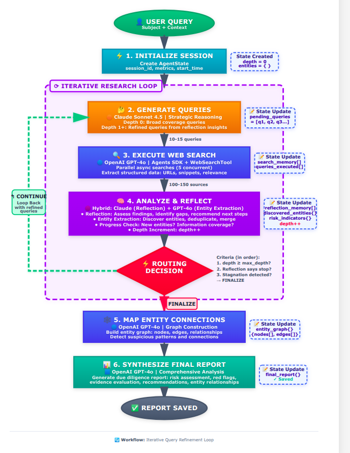

# DeepAgents: Autonomous Due Diligence Research System

[](https://www.python.org/downloads/)
[](https://langchain-ai.github.io/langgraph/)
[](docs/LLM_SERVICES.md)


A production-ready autonomous AI system for Enhanced Due Diligence (EDD) investigations using graph-based workflow orchestration with LangGraph and multi-model AI architecture (Claude Sonnet 4.5 + GPT-4o).

## Overview

## System Overview

DeepAgents is an **autonomous research agent** that conducts comprehensive Enhanced Due Diligence (EDD) investigations on individuals and entities. It orchestrates multiple AI models through a graph-based workflow to automatically gather intelligence, analyze risks, map relationships, and generate compliance-ready reports.

### How It Works

The system implements **graph-based workflow orchestration** using LangGraph to coordinate multiple specialized AI models in a stateful research pipeline:

1. **Iterative Research Cycle**
   - Generates strategic search queries based on reflection analysis
   - Executes parallel web searches to gather information
   - Analyzes findings and extracts insights
   - Decides whether to continue searching or finalize report
   - Loops until max depth reached, reflection recommends stopping, or stagnation detected

2. **Multi-Model Architecture**
   - **Claude Sonnet 4.5**: Strategic analysis, query generation, reflection (fast with simple schemas)
   - **GPT-4o/mini**: Web search, entity extraction, connection mapping, report synthesis (reliable structured output)

3. **Entity & Risk Intelligence**
   - Automatically discovers and deduplicates entities (persons, organizations, events)
   - Builds relationship graphs with pattern detection
   - Identifies risk indicators across multiple categories
   - Flags suspicious connections and conflicts of interest

4. **Comprehensive Reporting**
   - Generates structured due diligence reports
   - Risk assessment with severity levels (CRITICAL, HIGH, MEDIUM, LOW)
   - Complete source attribution and audit trail
   - Actionable recommendations

### Key Capabilities

**Autonomous Operation**
- No human intervention required during research
- Self-improving search through reflection-driven strategy
- Intelligent termination based on progress assessment

**Entity Tracking**
- LLM-based entity discovery and deduplication
- Handles aliases, variations, and name changes
- Builds comprehensive entity relationship graphs
- Pattern detection and suspicious connection flagging

**Risk Assessment**
- Multi-category risk detection (fraud, corruption, sanctions, PEP, regulatory, etc.)
- Severity-labeled red flags with evidence
- Source credibility evaluation
- Gap analysis and research limitations

**Production-Ready**
- Complete audit trail (JSONL format) for compliance
- Type-safe state management with immutable updates
- Configurable models and parameters (YAML-based)
- Dual logging (audit + operational) with optional LangFuse integration
- Error handling and recovery at all levels

### Architecture Overview

```
┌─────────────────────────────────────────────────────────┐
│                   User Interface                         │
│              CLI / Python API / REST API                 │
└──────────────────────┬──────────────────────────────────┘
                       ↓
┌─────────────────────────────────────────────────────────┐
│              DeepResearchAgent (Orchestrator)            │
│  • Session management    • Workflow execution            │
│  • Error handling        • Result aggregation            │
└──────────────────────┬──────────────────────────────────┘
                       ↓
┌─────────────────────────────────────────────────────────┐
│            LangGraph Workflow Engine                     │
│                                                           │
│  ┌──────┐   ┌──────┐   ┌──────┐   ┌──────┐            │
│  │ Init │──▶│Query │──▶│Search│──▶│Analyze│            │
│  └──────┘   └──────┘   └──────┘   └──┬───┘            │
│                                        │                 │
│                  ┌─────────────────────┘                 │
│                  │  [Routing Decision]                   │
│          ┌───────▼────────┬──────────────┐             │
│          │                │              │              │
│     ┌────▼───┐      ┌────▼────┐    ┌───▼────┐        │
│     │Continue│      │Connect  │    │Finalize │        │
│     │(Loop)  │      │(Graph)  │    │Report   │        │
│     └────────┘      └────┬────┘    └─────────┘        │
│                          │                             │
│                     ┌────▼────┐                        │
│                     │Synthesize│                       │
│                     └─────────┘                        │
└──────────────────────┬──────────────────────────────────┘
                       ↓
┌─────────────────────────────────────────────────────────┐
│                 Service Layer                            │
│  ┌──────────────┬──────────────┬──────────────┐        │
│  │OpenAI Service│Claude Service│Search Service│        │
│  │• Web Search  │• Reflection  │• Parallel    │        │
│  │• Entity Ops  │• Query Gen   │  Execution   │        │
│  │• Graph Build │• Analysis    │• Rate Limit  │        │
│  │• Synthesis   │              │              │        │
│  └──────────────┴──────────────┴──────────────┘        │
└──────────────────────┬──────────────────────────────────┘
                       ↓
┌─────────────────────────────────────────────────────────┐
│            Data & Observability Layer                    │
│  ┌──────────────┬──────────────┬────────────────┐      │
│  │State Models  │Audit Logger  │Operational Log │      │
│  │(Pydantic)    │(JSONL)       │(Structured)    │      │
│  └──────────────┴──────────────┴────────────────┘      │
└─────────────────────────────────────────────────────────┘
```

### Workflow Execution




### Use Cases

- **Investment Due Diligence**: Comprehensive background checks on executives, board members, major shareholders
- **Vendor Risk Assessment**: Third-party due diligence, supply chain risk analysis
- **Compliance & AML**: PEP screening, sanctions checking, adverse media monitoring
- **M&A Due Diligence**: Target company investigation, key person analysis
- **Background Verification**: Executive hiring, partnership evaluation
- **Investigative Research**: Fraud investigation support, litigation intelligence

---

## Quick Start

### Prerequisites

- Python 3.11+
- OpenAI API Key
- Anthropic API Key

### Installation

```bash
git clone <repository-url>
cd deepagents
pip install -r requirements.txt

# Configure API keys
cp .env.example .env
# Edit .env and add your API keys
```

### Basic Usage

```bash
# CLI execution
python -m src.main "Elizabeth Holmes" --context "Former CEO of Theranos" --max-depth 3

# Set custom search depth
python -m src.main "Bill Hwang" --max-depth 7
```
---

## Configuration

### Model Configuration

Edit `config/models.yaml` to change models without code changes:

```yaml
workflow:
  max_search_depth: 5
  max_queries_per_depth: 10
  max_concurrent_searches: 5

query_generation:
  provider: anthropic
  model: claude-sonnet-4-5-20250929
  temperature: 0.3

web_search:
  provider: openai
  model: GPT-4o
```

### Environment Variables

```bash
# Required
OPENAI_API_KEY=your_key
ANTHROPIC_API_KEY=your_key

# Optional (for observability)
LANGFUSE_PUBLIC_KEY=your_key
LANGFUSE_SECRET_KEY=your_key
```

---

## Output

Each research session generates:

1. **JSON Report** (`reports/sess_*_report.json`)
   - Executive summary & risk level
   - 18 comprehensive sections
   - Risk assessment with severity levels
   - Entity relationship graph
   - Source attribution and recommendations

2. **Audit Log** (`logs/sess_*.jsonl`)
   - Complete immutable event trail
   - All LLM calls with tokens/costs
   - Compliance-ready format

3. **Console Output**
   - Real-time progress updates
   - Summary metrics and statistics

---

## Performance

Typical session (depth=5, 10 queries/iteration):
- **Duration**: 6-8 minutes
- **Queries**: 40-50 total
- **Cost**: $2-5 USD
- **Entities**: 30-50 discovered
- **Sources**: 100-150 processed

**Performance Modes**:
- **Fast** (depth=2): 2-3 minutes
- **Balanced** (depth=5): 6-8 minutes
- **Quality** (depth=7): 12-15 minutes

---

## Documentation

| Document | Description |
|----------|-------------|
| [**QUICK_START.md**](docs/QUICK_START.md) | Installation, usage, configuration, troubleshooting |
| [**SOLUTION_DESIGN.md**](docs/SOLUTION_DESIGN.md) | Architecture, workflow, technical decisions, implementation details |

---

## 📄 PDF Report Generation

Convert JSON reports to professionally formatted PDFs:

```bash
# Convert all reports to PDF (default)
python convert_to_pdf.py

# Convert latest report only
python convert_to_pdf.py --latest

# Convert specific session
python convert_to_pdf.py --session sess_20251208_212522
```

**Features:**
- Professional formatting with color-coded risk levels
- Executive summary, findings, entity networks
- Comprehensive analysis sections
- PDFs saved alongside JSON files in `reports/`

---

## Project Structure

```
deepagents/
├── config/
│   └── models.yaml              # Model configuration
├── src/
│   ├── main.py                  # Entry point & DeepResearchAgent
│   ├── agents/
│   │   ├── graph.py            # LangGraph workflow definition
│   │   ├── nodes/              # 6 workflow nodes
│   │   └── edges/              # Routing logic
│   ├── services/
│   │   ├── llm/                # OpenAI & Claude services
│   │   └── search/             # Search execution
│   ├── models/                 # Pydantic data models & state
│   ├── prompts/                # Modular prompt templates
│   ├── observability/          # Dual logging system
│   ├── config/                 # Settings management
│   └── utils/                  # Helper functions
├── docs/                       # Documentation
├── tests/                      # Test suite with evaluation personas
├── logs/                       # Execution / Audit logs (JSONL)
└── reports/                    # Generated reports (JSON)
```

---

## 🧪 Research Sessions & Test Subjects

The following subjects have been researched and documented:

| Subject | Session ID | Report Generated | Execution Logs |
|---------|------------|------------------|----------------|
| **Andrew Ng** | sess_20251209_095140 | ✅ JSON + PDF | ✅ JSONL |
| **Bill Hwang** | sess_20251208_212522 | ✅ JSON + PDF | ✅ JSONL |
| **Isabel dos Santos** | sess_20251208_211141 | ✅ JSON + PDF | ✅ JSONL |
| **Adrian Cole** | sess_20251208_205804 | ✅ JSON + PDF | ✅ JSONL |
| **Dr. Lena Voronina** | sess_20251208_202514 | ✅ JSON + PDF | ✅ JSONL |
| **Elon Musk** | sess_20251208_201533 | ✅ JSON + PDF | ✅ JSONL |

All research reports include comprehensive due diligence analysis with entity graphs, risk assessments, and evidence-based findings.

---
