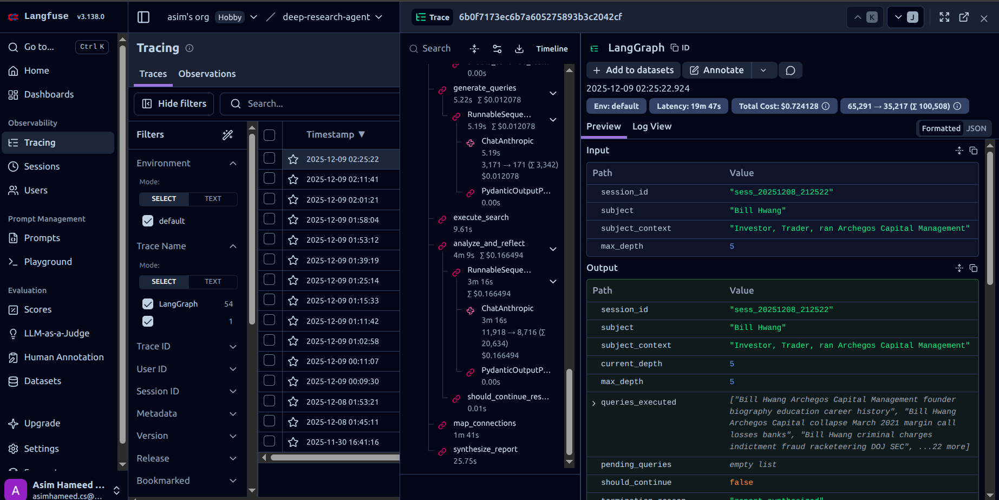

# Solution Design Document

**Status**: ✅ Production Ready  
**Last Updated**: December 7, 2025

## System Overview

DeepAgents is an autonomous research system for Enhanced Due Diligence (EDD) that orchestrates multiple AI models through a graph-based workflow to conduct comprehensive investigations.

### Core Capabilities

- **Reflection-Driven Strategy**: Iterative analysis guides search refinement
- **Entity Tracking**: LLM-based entity discovery and deduplication
- **Connection Mapping**: Relationship graph construction with pattern detection
- **Intelligent Routing**: Three termination criteria (max depth, reflection decision, stagnation)
- **Comprehensive Reporting**: due diligence reports with risk assessment

---

## Architecture

### Design Pattern

**Graph-Based Workflow Orchestration** using LangGraph with typed state management.

**Multi-Model Strategy**: Task-specific AI model selection
- **Claude Sonnet 4.5**: Strategic analysis, query generation (fast with simple schemas)
- **GPT-4o/mini**: Web search, entity extraction, graph operations (reliable structured output)

**State Management**: Centralized `AgentState` TypedDict maintains all progress and discoveries.

### System Diagram

```
User Input
    ↓
DeepResearchAgent (Orchestrator)
    ↓
LangGraph Workflow (6 Nodes)
    ↓
Service Layer (OpenAI + Claude)
    ↓
Data Layer (State + Logging)
```

---

## Workflow Execution

### Node Pipeline

```
1. Initialize
   • Set up session with defaults
   • Generate session_id
   • Initialize metrics

2. Generate Queries (Claude)
   • Depth 0: Broad coverage
   • Depth 1+: Strategic refinement from reflection
   
3. Execute Search (OpenAI)
   • Parallel web searches
   • Structured output extraction
   
4. Analyze & Reflect (Claude + OpenAI)
   • Reflection analysis (Claude)
   • Entity extraction & merging (OpenAI)
   • Progress assessment
   
5. [Routing Decision]
   • Max depth? → Finalize
   • Reflection stop? → Finalize
   • Stagnant? → Finalize
   • Otherwise → Continue (loop to step 2)
   
6. Map Connections (OpenAI)
   • Build entity graph
   • Detect patterns
   
7. Synthesize Report (OpenAI)
   • Generate report
   • Save to reports/
```

### Routing Logic

**File**: `src/agents/edges/routing.py`

Decision criteria (checked in order):
1. **Max depth reached** → Finalize
2. **Reflection recommends stop** → Finalize
3. **Stagnation detected** (no new entities for N iterations) → Finalize
4. **Otherwise** → Continue searching

**Key**: Depth increments AFTER analysis, BEFORE routing.

---

## Multi-Model Strategy

### Task-to-Model Mapping

| Task | Model | Why? |
|------|-------|------|
| Query Generation | Claude Sonnet 4.5 | Strategic reasoning, creative queries |
| Web Search | GPT-4o | Native WebSearchTool, cost-effective |
| Reflection/Analysis | Claude Sonnet 4.5 | Fast with text-heavy schemas |
| Entity Extraction | GPT-4o | Reliable structured output |
| Graph Operations | GPT-4o | Complex nested structures |
| Connection Mapping | GPT-4o | Pattern detection |
| Report Synthesis | GPT-4o | Long-form generation |

### Performance Insight

- **Claude**: Excellent for simple schemas (text-heavy), strategic thinking
- **OpenAI**: Better for complex structured outputs, graph operations
- **Result**: Fast, reliable, cost-optimized

---

## Core Components

### State Management

**File**: `src/models/state.py`

`AgentState` contains:
- Session info (session_id, subject, context)
- Progress tracking (current_depth, queries_executed)
- Control flow (should_continue, termination_reason)
- Memory (search_memory, reflection_memory)
- Entities (discovered_entities, entity_graph)
- Risk indicators (red_flags, neutral, positive)
- Metrics (search_count, iteration_count, errors)

**Immutability**: Always create new state, never mutate.

### Services

**OpenAI Service** (`src/services/llm/openai_service.py`):
- Agents SDK with WebSearchTool
- Structured output via Pydantic schemas
- Operations: web_search, map_entity_connections

**Claude Service** (`src/services/llm/claude_service.py`):
- Structured extraction via `with_structured_output()`
- Operations: extract_structured (for reflection, queries)

### Prompts

**Directory**: `src/prompts/`

Modular prompt architecture:
- `web_search.py` - Search instructions
- `query_generation.py` - Query prompts
- `analysis.py` - Reflection prompts
- `synthesis.py` - Report generation prompts

### Observability

**File**: `src/observability/logger.py`

**Dual Logging**:
1. **Audit Logs** (JSONL): Immutable, compliance-ready, all events
2. **Operational Logs**: Structured, debugging, metrics

**Optional**: LangFuse integration for distributed tracing.



*Example of LangGraph execution trace in LangFuse showing the complete workflow with timing, costs, and intermediate states.*


---

## Configuration

### YAML Configuration

**File**: `config/models.yaml`

Per-operation model settings:
```yaml
workflow:
  max_search_depth: 5
  max_queries_per_depth: 10
  max_concurrent_searches: 5

query_generation:
  provider: anthropic
  model: claude-sonnet-4-5-20250929
  temperature: 0.3

web_search:
  provider: openai
  model: GPT-4o
```

**Benefit**: Change models without code changes.

### Environment Variables

**File**: `.env`

Required:
- `OPENAI_API_KEY`
- `ANTHROPIC_API_KEY`

Optional:
- `LANGFUSE_PUBLIC_KEY`
- `LANGFUSE_SECRET_KEY`
- Workflow overrides (MAX_SEARCH_DEPTH, etc.)

---

## Data Flow

```
User: subject, context, max_depth
  ↓
Initialize: Create AgentState with defaults
  ↓
[LOOP START]
  Generate Queries (Claude)
    → pending_queries
  ↓
  Execute Search (OpenAI)
    → search_memory, queries_executed
  ↓
  Analyze & Reflect (Claude + OpenAI)
    → reflection_memory, discovered_entities
    → current_depth++ (increment)
  ↓
  Routing Decision
    → continue_search OR finalize
[LOOP END]
  ↓
Map Connections (OpenAI)
  → entity_graph
  ↓
Synthesize Report (OpenAI)
  → final_report, save to reports/
```

---

## Key Technical Decisions

### Why LangGraph?
- Type-safe state management
- Conditional routing built-in
- Workflow visualization
- LangChain ecosystem

### Why Multi-Model?
- Performance optimization (task-specific strengths)
- Cost optimization (use cheaper models where appropriate)
- Risk mitigation (not dependent on single provider)

### Why YAML Config?
- Easy A/B testing
- Non-technical configuration changes
- Environment-specific settings
- Model tuning without code

### Why Async?
- Parallel web searches (5x faster)
- Non-blocking I/O
- Better resource utilization

---

## Implementation Status

### ✅ Fully Implemented

**Core Workflow**:
- [x] LangGraph workflow (6 nodes)
- [x] Complete state management
- [x] Intelligent routing (3 criteria)
- [x] Session tracking

**Search & Analysis**:
- [x] OpenAI web search (Agents SDK)
- [x] Parallel async execution
- [x] Claude reflection analysis
- [x] Entity extraction & merging
- [x] Stagnation detection

**Entity Management**:
- [x] Entity discovery
- [x] LLM-based deduplication
- [x] Graph construction
- [x] Pattern detection
- [x] Suspicious connection flagging

**Reporting**:
- [x] due diligence report
- [x] Risk assessment with severity
- [x] Evidence evaluation
- [x] Recommendations
- [x] Complete metadata

**Infrastructure**:
- [x] Dual logging system
- [x] JSONL audit trail
- [x] Pydantic configuration
- [x] Environment management
- [x] Error handling

---

## File Organization

```
src/
├── agents/
│   ├── graph.py              # Workflow definition
│   ├── nodes/                # 6 workflow nodes
│   └── edges/                # Routing logic
├── services/
│   ├── llm/                  # OpenAI + Claude services
│   └── search/               # Search execution
├── models/
│   ├── state.py              # AgentState
│   └── search_result.py      # Pydantic models
├── prompts/                  # Prompt templates
├── observability/            # Logging system
├── config/                   # Settings
├── utils/                    # Helpers
└── main.py                   # Entry point

config/
└── models.yaml               # Model configuration

docs/
├── QUICK_START.md           # Getting started
└── SOLUTION_DESIGN.md       # This file

tests/
└── *.py                     # LLM Test suites
```

---

## Performance & Cost

### Typical Session (depth=5)

- **Duration**: 6-8 minutes
- **Queries**: 40-50 total
- **Entities**: 30-50 discovered
- **Sources**: 100-150 processed

### Optimization Strategies

**Fast Mode** (2-3 min):
- max_depth: 2
- max_queries_per_depth: 5

**Balanced Mode** (6-8 min):
- max_depth: 5
- max_queries_per_depth: 10

**Quality Mode** (12-15 min):
- max_depth: 7
- max_queries_per_depth: 15

---

## Limitations

### Known Constraints

1. **Web Search**: Limited to publicly accessible information via OpenAI's WebSearchTool
2. **LLM Costs**: Multiple calls per iteration (Claude + OpenAI)
3. **Context Limits**: Long sessions may approach token limits
4. **Entity Accuracy**: Depends on LLM quality for extraction
5. **Stagnation Detection**: Based on entity count, may not detect quality stagnation

### Production Considerations

- Respect API rate limits (`max_concurrent_searches`)
- Error handling in all nodes
- Audit trail for compliance
- Token tracking for cost monitoring
- Test with evaluation personas

---

## Extension Points

System designed for easy extension:

1. **New Workflow Nodes**: Add to `src/agents/nodes/`
2. **New LLM Providers**: Implement service interface in `src/services/llm/`
3. **Custom Routing**: Modify `src/agents/edges/routing.py`
4. **New Data Models**: Add to `src/models/`
5. **Custom Prompts**: Modify `src/prompts/`

---

## Dependencies

### Core
- `langgraph` - Workflow orchestration
- `agents` - OpenAI Agents SDK
- `anthropic` - Claude API
- `pydantic` - Data validation

### Supporting
- `langfuse` - Optional tracing
- `asyncio` - Concurrent execution

---

**For Quick Start**: See [QUICK_START.md](QUICK_START.md)
